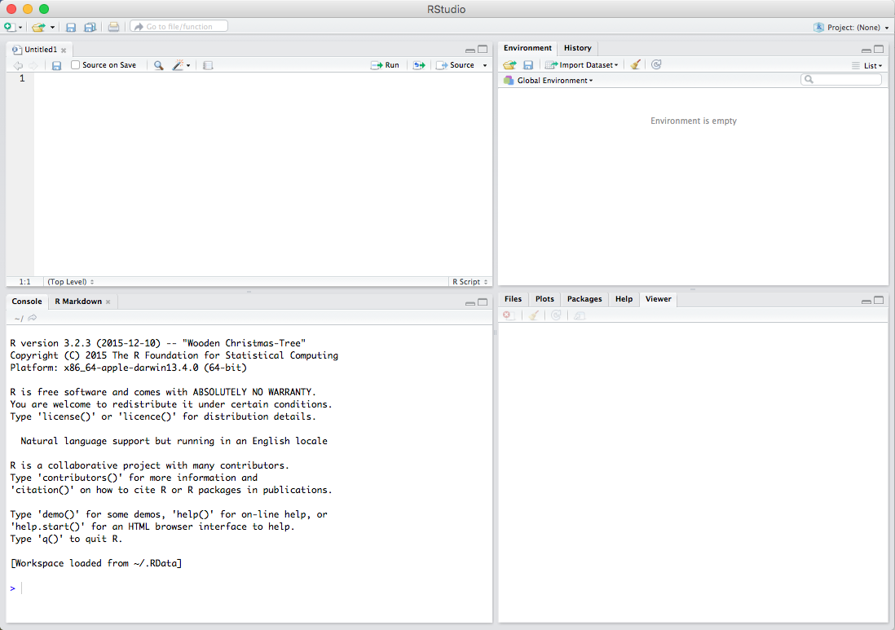
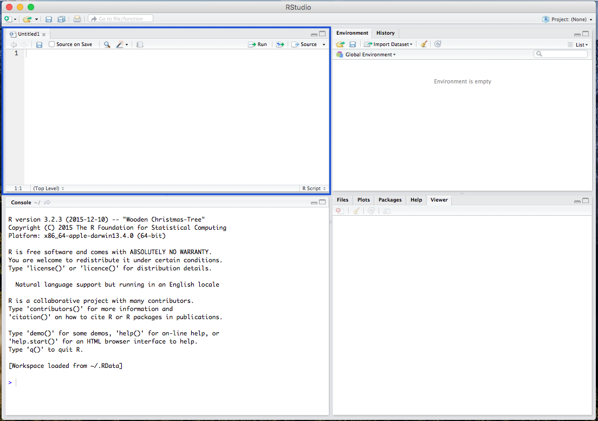
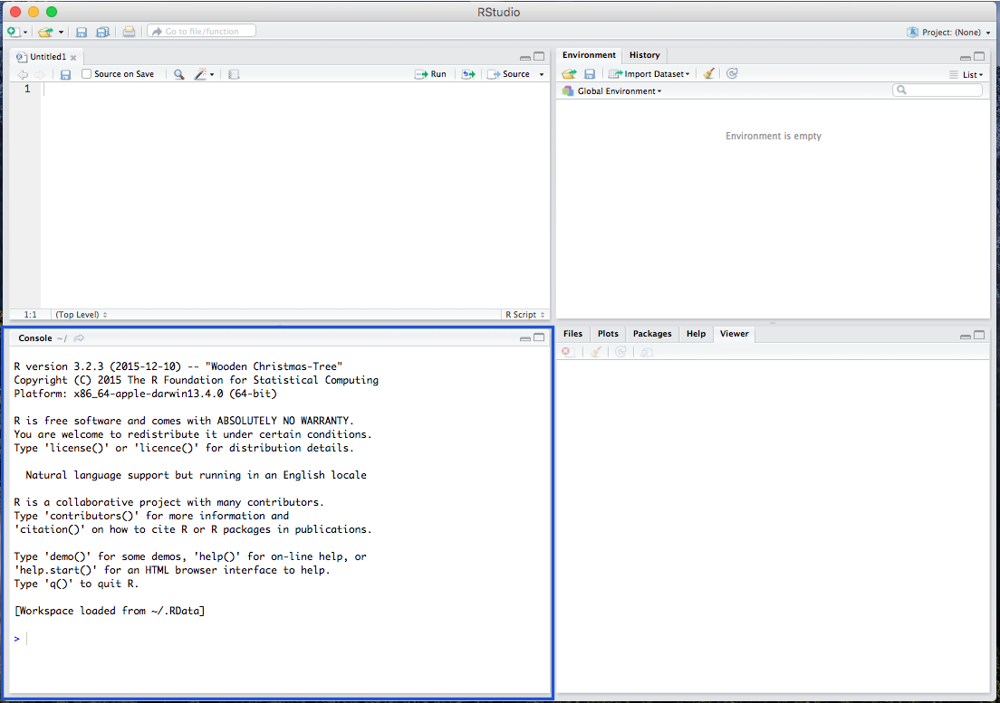
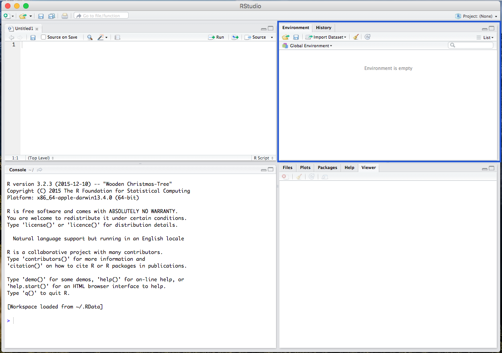
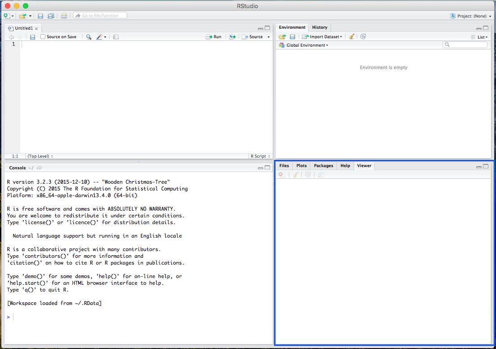

### What is R?

We will be using [R](http://cran.stat.ucla.edu/), an open-source statistical program. Open-source, of course, means that it is free to use. R is a programming language, and the basic R program runs through command-line. To make it easy on first-time users, we will also be  using R's graphical user interface, [RStudio](https://www.rstudio.com/products/rstudio/download2/), that runs R in one of its windows -- without you having to open R. 

### Downloading R

1. Go to the [R website](http://cran.stat.ucla.edu/) to download the program. Under the "Download and Install R" section, select the distribution that matches your computer's operating system (macOS/OSX, Windows, Linux). 

    + For Mac Users: On the next page, under the "Files" section, select the first file/link (which should be something like "R-3.3.1.pkg")

    + For Windows Users: On the next page, select the link/word "base". On the following page, select the large link (which should be something like "Download R 3.3.1 for Windows")

    + For Linux Users: On the next page, select your specific distribution, and follow the instructions.

2. For all users, install the downloaded R program.

3. Next, we will download [RStudio](https://www.rstudio.com/products/rstudio/download2/) which is a easily understandable user interface for using R. Under "Installers for Supported Platforms" select the RStudio installer that matches your operating system.

4. After the download is complete, install the RStudio program.

### Getting Started with R

Open the RStudio program, which should be linked to R.

 <br><br><br>

There are various windows within RStudio, including the Script window, where all your codes are viewable:

 <br><br><br>

The R console window where you paste and run your code:

 <br><br><br>

The Environment window, where your data and background processes are viewable:

 <br><br><br>

And the Plot/Viewer window, where your output figures/diagrams, help information, and file viewer are located:

 <br><br>


### Getting Familiar with R

Before running analyses, you have to set your working directory. This is the folder where your data/output is and will be saved. For example:

```{r}
setwd("/Users/burrelvannjr/Desktop")
```

# 

This will be different for you. To set your working directory, use <span style="color:blue">`setwd("directory")`</span>, using the location of your folder in place of the word "directory".


Througout the script, you'll also notice text with a hashtag or pound sign preceding it, like this <span style="color:green">`#this is how you set your working directory`</span>. This is a **comment**, which is just a note to yourself. Comments remind the user what the a bit of code is supposed to do.

Because R is and open-source statistical program, many of its functions are built by programmers in the form of **packages** or **libraries**. We will be using two packages in this exercise: the <span style="color:blue">`MASS`</span> and <span style="color:blue">`psych`</span> packages. In addition, sometimes you will need to pull in data from a file on the internet, and give your variables a description. For these tasks, we will need two more packages, the <span style="color:blue">`Hmisc`</span> and <span style="color:blue">`RCurl`</span> packages In order to get packages working, you must first install the packages then load the packages.

```{r, echo=F}
options(repos=c(CRAN="http://cran.stat.ucla.edu/"))
```

# 

Install the packages from the repository

```{r, results="hide"}
install.packages("MASS")
install.packages("psych")
install.packages("Hmisc")
install.packages("RCurl")
```

# 

Load the packages as libraries

```{r, results="hide", warning=FALSE, message=FALSE}
library(MASS)
library(psych)
library(Hmisc)
library(RCurl)
```


### Working with Data 

The <span style="color:blue">`MASS`</span> package comes with a great data set on car manufacturers called <span style="color:blue;background:none">`mtcars`</span>. To use the <span style="color:blue">`mtcars`</span> data, you must call it. Calling the data will load it into your console window

```{r}
mtcars
```

# 

While this is great, and the dataset is loaded into your console window, you will need a local copy to run operations on. The great thing about R is that it uses Object-Oriented Programming, meaning that you can assign a name to an object (like a data set), which will create a working copy in your computer's memory for you to run operations on. To do so, you simply must assign a name using a *left arrow* (the assignment operator) like this: <span style="color:blue">`new_object<-dataset`</span>. So to work with the <span style="color:blue">`mtcars`</span> data, you should call it something new, like this:

```{r}
data1<-mtcars
```

# 
  * For your homework and in all your future work, you'll need to read in a separate data set that exists on your computer or from an online source, not in one of R's packages. To do so, you'll have to use the assignment operator to call in data with one of R's functions (the <span style="color:blue">`read.csv`</span>. You can do it like this, changing the word "DATA" to the actual name the csv file you're bringing in: 
    + <span style="color:blue">`data1<-read.csv("DATA.csv",header=TRUE,sep=",")`</span>. 
  * Also, using the <span style="color:blue">`RCurl`</span> package, we can pull in data from the web by replacing the word "LINK" with the link to the data file you want to use:
    + <span style="color:blue">`data1<-read.csv(text=getURL("LINK.csv"))`</span>

  * Also, using the <span style="color:blue">`Hmisc`</span> package, we can add variable labels to the data set by reading in a separate LABELS file
    + <span style="color:blue">`source("LABELS.R")`</span>
  * or you can pull in the script from the web by replacing the word "LINK" with the link to the script file:
    + <span style="color:blue">`source("LINK.R")`</span>

    
# 

Like above, you can now call <span style="color:blue">`data1`</span>, and it will load the same data set into your console window (not shown here). In addition, in RStudio, after you give the data a new name (converting it to a usable object), you can view the data in your upper-right **Environment** window.

# 


To call a specific *variable* or column within the data set, you simply use the dollar sign operator <span style="color:blue">`$`</span>, in the form of <span style="color:blue">`data$variable`</span>. To call the <span style="color:blue">`mpg`</span> variable from the new <span style="color:blue">`data1`</span> data set, we use the following.

```{r}
data1$mpg
```

### Univariate Statistics

There are various ways to call a number of univariate statistics in R. As social scientists, the main univariate statistics we are concerned with are the mean, median, standard deviation, minimum, maximum, and range. The stock R program comes with the <span style="color:blue">`summary`</span> function. 

```{r}
summary(data1)
```

# 

This calls univariate statistics for all variables in the data set, but you can also call these same univariate statistics for individual variables, like:

```{r}
summary(data1$mpg)
```

# 

However, the stock function does not provide the measures for Standard Deviation or Range. Therefore, we can use the <span style="color:blue">`describe`</span> function from the <span style="color:blue">`psych`</span> package. Again, we can call the statistics for both the full data set and a specific variable.

```{r}
describe(data1)
describe(data1$mpg)
```

# 

In addition, you can call desired univariate statistics. Here, we'll run the statistics on the <span style="color:blue">`mpg`</span> variable.

```{r}
mean(data1$mpg)
median(data1$mpg)
sd(data1$mpg)
min(data1$mpg)
max(data1$mpg)
range(data1$mpg)
```

# 

You'll notice there's a range problem. To fix this, we can incorporate our assignment operator <span style="color:blue">`<-`</span> to create new variables in working memory. An appropriate range value is the difference between the maximum and minimum values. Using this knowledge, we can solve the problem ourselves.

```{r}
min1<-min(data1$mpg)
max1<-max(data1$mpg)
max1-min1
```

# 

or another way...

```{r}
range1<-max1-min1
range1
```

# 

or another way, without renaming anything

```{r}
max(data1$mpg)-min(data1$mpg)
```

# 

In addition, you can create a visual representation (plot) of the univariate data using a histogram. Use the <span style="color:blue">`hist`</span> function to plot a histogram.

```{r}
hist(data1$mpg)
```


### Working with Random, Normally-Distributed Data

R also has a number of functions that work to create random data. To create random, normally-distributed data, use the <span style="color:blue">`rnorm`</span> function, which takes a maximum of three arguments. It should look something like this <span style="color:blue">`rnorm(100,0,1)`</span>, where the first number (here, <span style="color:blue">`100`</span>) represents the number of cases or data points you want in your random normally-distributed data. The second argument/number (here <span style="color:blue">`0`</span>) is the mean that you want your data to have. The third number/argument (here <span style="color:blue">`1`</span>) is the standard deviation that you want your data to have. 

Note that the <span style="color:blue">`rnorm`</span> function takes a maximum of three arguments -- and it takes a minimum of one argument (the number of cases/data points). The default settings for the <span style="color:blue">`rnorm`</span> function is mean of 0 and a standard deviation of 1. This means that <span style="color:blue">`rnorm(100)`</span> and <span style="color:blue">`rnorm(100,0,1)`</span> will output similar means and standard deviations. Similar, not the exact same, because these data are *randomly* generated, so the values of the data points will vary a bunch but still have a mean of 0 and standard deviation of 1. 

```{r, results="hide"}
rnorm(100,0,1)
rnorm(100)
```

# 

Obviously, you can alter the number of cases involved.

# 


```{r}
rnorm(10)
```

# 

or...

# 

```{r}
rnorm(100)
```

# 

or even...

# 

```{r, results="hide"}
rnorm(1000)
```
(output supressed)

# 

You can also use the assignment operator <span style="color:blue">`<-`</span> to assign the values of the <span style="color:blue">`rnorm`</span> function to an object:

```{r}
ten<-rnorm(10)
hundred<-rnorm(100)
thousand<-rnorm(1000)
```

# 

Then you can run univariate statistics on those data, and even create a histogram for the data:

# 

```{r}
mean(thousand)
median(thousand)
sd(thousand)
min(thousand)
max(thousand)
range<-max(thousand)-min(thousand)
range
hist(thousand)
```

# 
# 

Finally, you can see how histograms differ when all you do is alter the number of cases:

```{r}
hist(ten)
hist(hundred)
hist(thousand)
```

So now you know that the more cases/data points you have, the more your data will mimic the normal distribution (bell curve).

<br><br><br>
