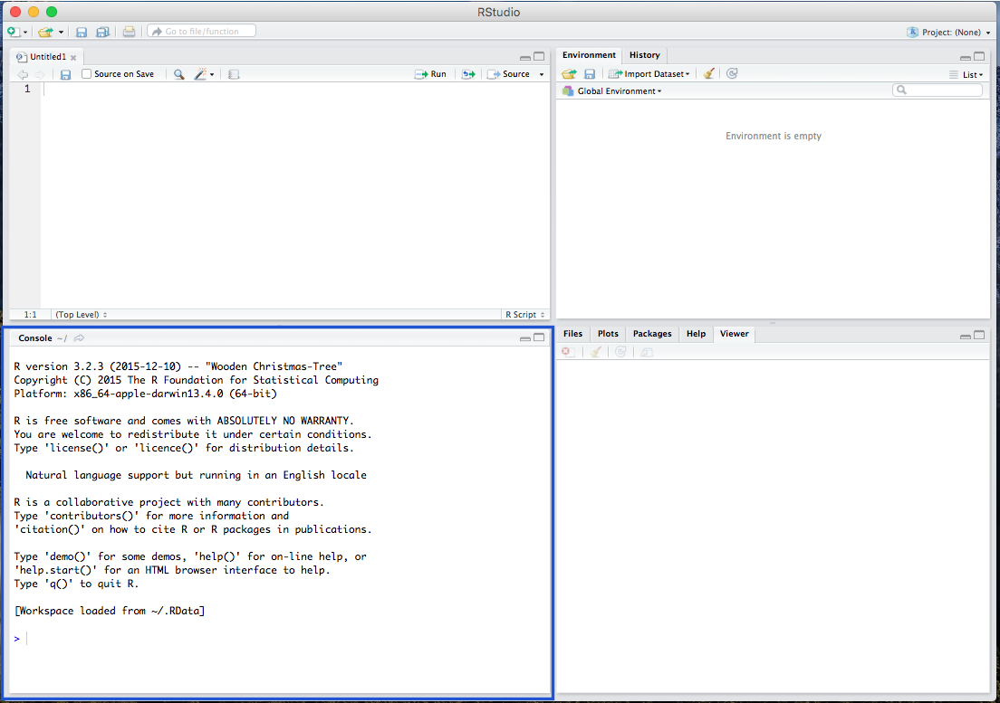

<br>


###### Page Navigation

* [Intro to R](Intro-and-Univariate-Statistics.html)
* [t-Test](t-test.html)

<br>

### What is R?

We will be using [R](http://cran.stat.ucla.edu/), an open-source statistical program. Open-source, of course, means that it is free to use. R is a programming language, and the basic R program runs through command-line. To make it easy on first-time users, we will also be  using R's graphical user interface, [RStudio](https://www.rstudio.com/products/rstudio/download2/), that runs R in one of its windows -- without you having to open R. 

### Downloading R

1. Go to the [**R website**](http://cran.stat.ucla.edu/) to download the program. Under the "Download and Install R" section, select the distribution that matches your computer's operating system (macOS/OSX, Windows, Linux). 

    + For Mac Users: On the next page, under the "Files" section, select the first file/link (which should be something like "R-3.x.x.pkg")

    + For Windows Users: On the next page, select the link/word "base". On the following page, select the large link (which should be something like "Download R 3.x.x for Windows")

    + For Linux Users: On the next page, select your specific distribution, and follow the instructions.

2. For all users, install the downloaded R program.

3. Next, we will download [**RStudio**](https://www.rstudio.com/products/rstudio/download2/) which is a easily understandable user interface for using R. Under "Installers for Supported Platforms" select the RStudio installer that matches your operating system.

4. After the download is complete, install the RStudio program.

### Getting Started with R

Open the RStudio program, which should be linked to R.

 <br><br><br>

There are various windows within RStudio, including the Script window, where all your codes are viewable:

 <br><br><br>

The R console window where you paste and run your code:

 <br><br><br>

The Environment window, where your data and background processes are viewable:

 <br><br><br>

And the Plot/Viewer window, where your output figures/diagrams, help information, and file viewer are located:

 <br><br>


### Getting Familiar with R

#

#### Setting the Working Directory

Before running analyses, you have to set your working directory. This is the folder where your data/output is and will be saved. For example, I use the following:

```{r}
setwd("/Users/burrelvannjr/Desktop/PA606")
```

# 

This will be different for you. To set your working directory, use <span style="color:blue">`setwd("directory")`</span>, and replace the word "directory" with the *pathname* of the folder you want to be your directory (or under the **Session** menu, select **Set Working Directory**, then select **Choose Directory** and navigate to your desired folder).

#

#### Installing Packages and Loading them for Use as Libraries

Because R is and open-source statistical program, many of its functions are built by programmers in the form of **packages** or **libraries**. We will be using four packages in this exercise: the <span style="color:blue">`MASS`</span>, <span style="color:blue">`psych`</span>, <span style="color:blue">`lattice`</span>, and <span style="color:blue">`mosaic`</span> packages. 

```{r, echo=F}
options(repos=c(CRAN="http://cran.stat.ucla.edu/"))
```

# 

Install the packages from the repository (copy and paste the lines below)
```
install.packages("MASS")
install.packages("psych")
install.packages("lattice")
install.packages("mosaic")
```

# 

#

Load the packages as libraries

```{r, results="hide", warning=FALSE, message=FALSE}
library(MASS)
library(psych)
library(lattice)
library(mosaic)
```

#

#

#### A Note on Commenting

Througout any script, you'll also notice a line of text with a pound sign (e.g. hashtag) preceding it, like this <span style="color:green">`#this is a how to calculate a mean`</span>. This is a **comment**, which is just a note to yourself. Comments remind the user what the a bit of code is supposed to do.

#

#


### Working with Data 

#

#### Calculations

In R/RStudio, we can use the Script (and Console) window to make calculations. For example, we can run the following...

```{r}
3 + 2
```

#

#### The Assignment Operator for Creating Objects

#


The great thing about R is that, because it is an object-oriented programming language, you can assign **object names** to any calculation or data set. This creates a working copy of the calculation (or data set) in R's memory that you can run operations on. To do so, you simply must assign an object name using a *left arrow* (the assignment operator) like this: <span style="color:blue">`new_object <- dataset`</span>.  For example, we could run...

```{r}
x <- 3 + 2
```

... and then run...

```{r}
x
```

... which gives us the same result, but now we can run manipulations on the new object (or variable) **x**.

#

#### Creating a List as an Object

Sometimes, for quick analyses, you may need to read in a list of numbers (in your working Environment). To read in a list, you use the concatenate <span style="color:blue">`c`</span> function. You can create a list by replaceing the word "LIST" from this with the actual list: <span style="color:blue">`c(OBJECT)`</span>. 

To create an object out of a list of numbers, we could do the following...


```{r}
list <- c(1, 6, 3, 2, 7, 4, 6, 9)
```


Now that <span style="color:blue">`list`</span> is a useable object, we can run manipulations and univariate statistics on it (described below).

```{r include = FALSE}
mean(list)
mean<-mean(list)
sd(list)
sd<-sd(list)
n<-NROW(list)
z<-1.96
se<-((sd)/(sqrt(n)))
list((mean-(z*se)),(mean+(z*se)))
```


#


#### Removing Objects from your Enviornment

Many times, we'll be working with several objects, and ultimately decide that some of them are no longer needed. In this case, we would want to tidy up our environment by removing an object. To do so, we must use the <span style="color:blue">`rm`</span> function. You can do it like this, changing the word "OBJECT" to the name of the object that you're trying to remove from the R environment: <span style="color:blue">`rm(OBJECT)`</span>. 

```{r, results="hide"}
rm(x)
```


#### Reading in CSV Data Sets

Many data sets that researchers work with come in the form of a **CSV** file. A CSV (Comma Separated Values) file is just a Microsoft Excel spreadsheet (with rows as observations and columns as variables), that is converted into CSV format. 

A CSV file must be "read" into the R environment for you to use it. To do so, you'll have to call in the CSV file (data set) with one of R's functions: the <span style="color:blue">`read.csv`</span> function. Additionally, you will have to give the CSV a new object name (using the assignment operator **<-**), so we can place it in our working environment. You can do it like this, changing the word "PATHNAME" to the pathname to the csv file you're reading into the R environment: <span style="color:blue">`data1 <- read.csv("PATHNAME.csv", header=TRUE, sep=",")`</span>. 

#

#### Working with Stock Data Sets in R

Fortunately, nearly every package in R comes with a data set that R users can use. The <span style="color:blue">`MASS`</span> package, for example, comes with a great data set on car manufacturers called <span style="color:blue;background:none">`mtcars`</span>. To use this <span style="color:blue">`mtcars`</span> data set, you must call it. Calling the data will load it into your console window. To call a stock data set, just type in the name of the data set (*Note: The data set you're calling must come from a package that is already LOADED into your R session*). Because the <span style="color:blue;background:none">`MASS`</span> package is already loaded, we can call our <span style="color:blue;background:none">`mtcars`</span> data set as such...

```{r}
mtcars
```

# 

While this is great, and the dataset is loaded into your console window, you will need a local copy to run operations on. To create a local copy (an object) so that you can run manipulations on the <span style="color:blue">`mtcars`</span> data, you should create a new object, like this:

```{r}
data1 <- mtcars
```

# 


    
# 

Like above, you can now call <span style="color:blue">`data1`</span>, and it will load the same data set into your console window (not shown here). In addition, in RStudio, after you give the data a new name (converting it to a usable object), you can view the data in your upper-right **Environment** window.

# 

#### Calling information for a Variable


To call a specific *variable* or column within the data set, you simply use the dollar sign operator <span style="color:blue">`$`</span>, in the form of <span style="color:blue">`data$variable`</span>. To call the <span style="color:blue">`mpg`</span> variable from the new <span style="color:blue">`data1`</span> data set, we use the following.

```{r}
data1$mpg
```

### Univariate Statistics

There are various ways to call a number of univariate statistics in R. As social scientists, the main univariate statistics we are concerned with are the mean, median, standard deviation, minimum, maximum, and range. The stock R program comes with the <span style="color:blue">`summary`</span> function, which, unfortunately, does not provide the *some* measures. Therefore, we use the <span style="color:blue">`describe`</span> function from the <span style="color:blue">`psych`</span> package. We can call univariate statistics for both the full data set and a specific variable.

#

For the full data set, we can call univariate statistics as such... 

```{r}
describe(data1)
```

#

Whereas, for a specific variable, we can call univariate statistics as such...

```{r}
describe(data1$mpg)
```

#

In addition, we can call univariate statistics for a variable but broken out by groups/categories of another variable. Note, this is the first step towards bivarate statistics (looking at the relationship between two variables). We do this by using the <span style="color:blue">`describeBy`</span> function, where we list the main variable first, and the grouping/category variable second... as such... 

```{r}
describeBy(data1$mpg, data1$cyl)
```

#
Above, we can see that the mean miles per gallon differs by the number of cylinders in a car (e.g. cars with lower cylinders have, on average, higher miles per gallon).

#### A Note on Skewness and Kurtosis

**Skewness** is the measure of how close or far a distribution is from symmetry (the normal curve). It measures the clustering of scores along the X-axis, with regard to the position of the mode, median, and mean. **Kurtosis** is a measure of the *peakedness* of the distribution - how high or low the distribution is on the Y-axis, and how different it is from mesokurtic (e.g. middle kurtosis, or the normal curve).

#

Skewness ranges from $-\infty$ to $\infty$. The sign indicates the type of skew, with $-$ indicating negative skewness, $+$ indicating positive skewness, and 0 indicating *no* skew... (AKA symmetry, AKA the normal curve). The cutoffs for skewness are as follows:

High: $\geq |1|$

Moderate: $|1| \geq x \geq |.5|$

Low: $|.5| \geq x \geq |0|$

#
#

Statisticians have developed a kurtosis measure that represents *excess* kurtosis beyond the normal curve (*although typical kurtosis ranges from 1 to $+ \infty$*). This measure ranges from $-2$ to $+ \infty$. Using this metric, we know that, generally, negative values represent platykurtic distributions and positive values indicate leptokurtic distributions. Distributions close to a kurtosis value of 0 are considered mesokurtic. We use cutoffs to indicate types of kurtosis, as follows...

Platykurtic: $0 \geq x \geq -2$

Mesokurtic: $1 \geq x \geq 0$

Leptokurtic: $+ \infty \geq x \geq 1$


# 

#### Calling Specific Univariate Statistics

Beyond using the <span style="color:blue">`describe`</span> function, you can call singular desired univariate statistics. Here, we'll ask for a specific univariate statistic, one at a time, for the <span style="color:blue">`mpg`</span> variable.

#

Below, we've added the option for <span style="color:blue">`, na.rm=T`</span> (alternatively, <span style="color:blue">`, na.rm=TRUE`</span>), meaning that if data or observations are missing/NA for the variables we're working with, we still want R to calculate the statistic for the non-missing cases by removing those missing cases (NAs), select TRUE. 


```{r}
mean(data1$mpg, na.rm=T)
median(data1$mpg, na.rm=T)
sd(data1$mpg, na.rm=T)
min(data1$mpg, na.rm=T)
max(data1$mpg, na.rm=T)
range(data1$mpg, na.rm=T)
```

# 


### Assessing Normality by Using Visualizations

#### Histograms

In addition, you can create a visual representation (plot) of univariate data using a histogram. For quickly plotting the histogram of one variable, we can use R's stock <span style="color:blue">`hist`</span> function, as such...

```{r}
hist(data1$mpg) 
```

#

However, as we begin to move into analyzing bivariate relationships, we may find it necessary to visualize histograms by overlaying normal curves (to demonstrate normality) or to break out the histogram by levels or categories of different variables (to demonstrate within group normality). As such, we should rely on the <span style="color:blue">`histogram`</span> function from the <span style="color:blue">`lattice`</span> package to plot a histogram.

```{r}
histogram(~ mpg, data = data1, main = "Histogram of 'Miles per Gallon'", type = "count") 
```

This should look *similar* to the plot produced by the <span style="color:blue">`hist`</span> function, but it differs in that we can do much more... such as plotting the histogram with a normal curve overlaid, including the placement of the mean. 

#
```{r}
histogram(~ mpg, data = data1, main = "Histogram of 'Miles per Gallon'", 
          type = "density", 
          panel=function(x, ...) {
            panel.histogram(x, ...)
            panel.abline(v=mean(x, na.rm = TRUE),col="red")
            panel.mathdensity(dmath=dnorm, col="black", 
                              args=list(mean=mean(x, na.rm = TRUE),
                                        sd=sd(x, na.rm = TRUE)), ...)            
          }) 
```


Or plotting the histogram for mpg broken out by cylinders...  

```{r}
histogram(~ mpg | cyl, data = data1, type = "count", main = "Histogram of 'Miles per Gallon' by 'Cylinder'")
```

#


#### Boxplots (Box-and-Whisker Plots)

Boxplots also provide a visual representation of the normality of a distribution. The boxplot has a box, a line through the box, two whiskers on either end of the box, and sometimes dots/points outside the whiskers. Below, we get a sense of what each part of the boxplot represents...

+ Bottom (or left end) of the **whisker** represents the minimum score for that variable's distribution
+ Bottom (or left end) of the **box** represents the first quartile (the 25th percentile case)
+ Middle line (or dot) inside the **box** represents the median, also known as the second quartile (the 50th percentile case)
+ Top (or right end) of the **box** represents the third quartile (the 75th percentile case)
+ Top (or right end) of the **whisker** represents the maximum score for that variable's distribution
+ Outside dots represent outliers - extreme high or extreme low values for that variable. 

#
#

To tell if a variable is normally-distributed using the box-and-whisker plot, generally, we want to see that there is *some* distance between the box and the end of the whiskers, that the box isn't pushed too close to either whisker, that the median line (dot) is near the center of the box, and that there aren't many outliers (dots) on the outside of the whiskers.

#


To plot a boxplot, we use the following... (notice that when you're plotting one variable, the plot is displayed horizontally).


```{r}
bwplot(~mpg, data = data1, pch="|", main = "Bar-and-Whisker Plot of 'mpg'")
```

#

Further, to break this distribution out by *Cylinder*, we can do the following...


```{r}
bwplot(~mpg | cyl, data = data1, pch="|", main = "Bar-and-Whisker Plot of 'mpg' by 'Cylinder'")
```


#### Normal Q-Q (Quantile-Quantile) Plots

Much as in the above, we want to assess whether or not our variable follows the normal distribution. As such, the quantile-quantile plot is a visual tool to help us figure out if the empirical distribution of our variable fits (or rather, comes from) a theoretical normal distribution.

We fit a plot of our data/variable (usually on the Y-axis) against theoretical data that should occur if the data came from a normal distribution. If our data actually fit a normal curve, then the dots on the plot should follow a straight line, or be reasonably close to the line plotted. 

Below, we can assess normality to determine whether our variable follows a normal distribution, as such... 


```{r}
xqqmath(~mpg, data=data1, fitline = TRUE, main = "Normal Q-Q Plot of 'Wr.Hnd'", xlab = "Expected Normal")
```


Additionally, we can break this plot out by another grouping variable. 

```{r}
xqqmath(~mpg | cyl, data=data1, fitline = TRUE, main = "Normal Q-Q Plot of 'Wr.Hnd' by 'Cylinder'", xlab = "Expected Normal")
```

### Working with Random, Normally-Distributed Data

R also has a number of functions that work to create random data. To create random, normally-distributed data, use the <span style="color:blue">`rnorm`</span> function, which takes a maximum of three arguments. It should look something like this <span style="color:blue">`rnorm(100,0,1)`</span>, where the first number (here, <span style="color:blue">`100`</span>) represents the number of cases or data points you want in your random normally-distributed data. The second argument/number (here <span style="color:blue">`0`</span>) is the mean that you want your data to have. The third number/argument (here <span style="color:blue">`1`</span>) is the standard deviation that you want your data to have. 

Note that the <span style="color:blue">`rnorm`</span> function takes a maximum of three arguments -- and it takes a minimum of one argument (the number of cases/data points). The default settings for the <span style="color:blue">`rnorm`</span> function is mean of 0 and a standard deviation of 1. This means that <span style="color:blue">`rnorm(100)`</span> and <span style="color:blue">`rnorm(100,0,1)`</span> will output similar means and standard deviations. Similar, not the exact same, because these data are *randomly* generated, so the values of the data points will vary a bunch but still have a mean of 0 and standard deviation of 1. 

```{r, results="hide"}
rnorm(100,0,1)
rnorm(100)
```

# 

Obviously, you can alter the number of cases involved.

# 


```{r}
rnorm(10)
```

# 

or...

# 

```{r}
rnorm(100)
```

# 

or even...

# 

```{r, results="hide"}
rnorm(1000)
```
(output supressed)

# 

You can also use the assignment operator <span style="color:blue">`<-`</span> to assign the values of the <span style="color:blue">`rnorm`</span> function to an object:

```{r}
ten<-rnorm(10)
hundred<-rnorm(100)
thousand<-rnorm(1000)
```

# 

Then you can run univariate statistics on those data, and even create a histogram for the data:

# 

```{r}
mean(thousand)
median(thousand)
sd(thousand)
min(thousand)
max(thousand)
range<-max(thousand)-min(thousand)
range
hist(thousand)
```

# 
# 

Finally, you can see how histograms differ when all you do is alter the number of cases:

```{r}
hist(ten)
hist(hundred)
hist(thousand)
```

So now you know that the more cases/data points you have, the more your data will mimic the normal distribution (bell curve).

<br><br><br>
