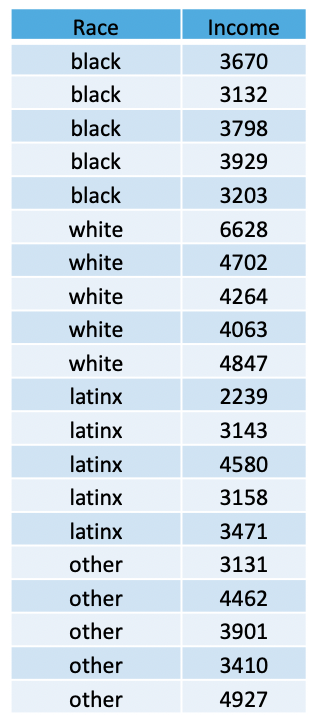

###### Navigation

* [**Intro to R**](Intro-and-Univariate-Statistics.html)
* [**t-Test**](t-test.html) [[*t-Test example*]](t-test-example.html)
* [**Analysis of Variance (ANOVA)**](anova.html) [[*ANOVA example*]](anova-example.html)
* [**Chi Square**](chi-square.html) [[*Chi Square example*]](chi-square-example.html)
* [**Correlation**](correlation.html) [[*Correlation example*]](correlation-example.html)
* [**Regression**](regression.html) [[*Regression example*]](regression-example.html)


### Is there a mean difference in monthly income across different racial groups?


#### The Analysis of Variance (ANOVA)

The ANOVA is a bivariate (two variable) test that examines the differences in means between **three or more** groups, in effort to see if the differences reflect true differences that we could expect to find in the population. The resulting test calculates an F value.  

For this example, the ANOVA works because we have have four groups (black, white, latinx, and other), and we're examining each group's mean monthly income to see if there is a true difference in income amongst racial groups in the population. 


```{r, echo=F}
options(repos=c(CRAN="http://cran.stat.ucla.edu/"))
```

# 


```{r, results="hide", warning=FALSE, message=FALSE}
library(MASS)
library(psych)
library(lattice)
library(mosaic)
#install.packages("gplots")
library(gplots)
library(stats)
```

#


#### Reading in the Data

```{r, out.width = "200px", echo=FALSE}

```

In the table (above), we have a total of 20 people, randomly-sampled. We see that we have a total of 5 people within each racial category (black, white, latinx, and other), and each individual has a monthly income value. We can use these data to create a data set, using a combination of the concatenate, <span style="color:blue">`c()`</span>, data frame <span style="color:blue">`data.frame`</span>, and the repeat <span style="color:blue">`rep()`</span> functions. 

The repeat function comes in handy when you have to type out the same values over and over again. This function has two arguments: 1) the thing you want to repeat, and 2) the number of times you want to repeat it. 

Using this logic, we can apply the repeat function to create each variable, concatenating across the various categories of each variable, and combine these variables into a data frame... as such... 

```{r}
race <- c(
  rep("black",5),
  rep("white",5),
  rep("latinx",5),
  rep("other",5))

inc <- c(3670, 3132, 3798, 3929, 3203, 6628, 4702, 4264, 4063, 4847, 2239, 3143, 4580, 3158, 3471, 3131, 4462, 3901, 3410, 4927)

```

Next, we merge the variables into one data frame, using the following:

```{r}
data <- data.frame(race,inc)
```

Now we can call the data... 

```{r}
data
```


#### Assumptions and Diagnostics for the ANOVA

The assumptions for an ANOVA are...

* Independence of Observations
* Equal Sample Sizes
* Homogeneity of Variance
* Normality


##### 1. Independence of Observations (Examine Data Collection Strategy)
* Groups are not related or dependent upon each other. Cases can’t be in more than one group. No ties between observations. Examine data collection strategy to see if there are linkages between observations. 
  + <span style="color:red">These data were randomly sampled. `Therefore, we meet the assumption of independence of observations`.</span> 

##### 2. Equal Sample Sizes (Examine N for each group)
* The number of cases in each group should be relatively similar. 
  + <span style="color:red">The sample size for each group is exactly the same for all groups. `Therefore, we have met the assumtption for equal sample sizes`.</span> 

##### 3. Homogeneity of Variance (Examine SD^2^ for each group)
* All groups have approximately equal variances (SD^2^). The distributions (or spread) for the groups are approximately equal. Keppel & Zedeck (1989) suggest that variance comparison should not exceed 10:1 ratio (*or... alternatively, the SDs, when compared, should not exceed around a 3:1 ratio*). For both of the above assumptions, we can examine the univariate data table, broken out by group:

```{r}
describeBy(data$inc, data$race)
```

  + <span style="color:red">We can see from the output that, comparing the SD for all groups, there is not a ratio larger than 3:1. For these data, the largest descrepancy between SDs for each group is between black individuals (SD = 358.68) and white individuals (SD = 1016.5), which is less than the 3:1 ratio suggested. `Therefore, we have met the assumption for homogeneity of variance`.</span> 

##### 4. Normality (Examine Plots: Histogram, Q-Q Normality Plots, Box-and-Whiskers Plots)
* Distribution must be relatively normal. 

##### 4a. Histogram

Plot the histogram for *Monthly Income* (Y variable) broken out by *Racial Category* (levels of the X variable), overlaying a normal curve... 


```{r}
histogram(~ inc | factor(race), data = data, main = "Histogram of 'Monthly Income' by 'Race'", 
          type = "density", 
          panel=function(x, ...) {
            panel.histogram(x, ...)
            panel.abline(v=mean(x, na.rm = TRUE),col="red")
            panel.mathdensity(dmath=dnorm, col="black", 
                              args=list(mean=mean(x, na.rm = TRUE),
                                        sd=sd(x, na.rm = TRUE)), ...)            
          }) 
```

  + <span style="color:red">We can see from the histogram that for both group distributions of the outcome variable (beers), the data are moderately positively skewed (with the exeception of the distribution of scores for black individuals). Although these are moderately skewed, it is safe to assume that these data are close enough to normal to proceed with the statistical test.</span> 

##### 4b. Boxplots (Box-and-Whisker Plots)

Boxplots also provide a visual representation of the normality of a distribution. The boxplot has a box, a line through the box, two whiskers on either end of the box, and sometimes dots/points outside the whiskers. Below, we get a sense of what each part of the boxplot represents...

+ Bottom (or left end) of the **whisker** represents the minimum score for that variable's distribution
+ Bottom (or left end) of the **box** represents the first quartile (the 25th percentile case)
+ Middle line (or dot) inside the **box** represents the median, also known as the second quartile (the 50th percentile case)
+ Top (or right end) of the **box** represents the third quartile (the 75th percentile case)
+ Top (or right end) of the **whisker** represents the maximum score for that variable's distribution
+ Outside dots represent outliers - extreme high or extreme low values for that variable. 

#
#

To tell if a variable is normally-distrubted using the box-and-whisker plot, generally, we want to see that there is *some* distance between the box and the end of the whiskers, that the box isn't pushed too close to either whisker, that the median line (dot) is near the center of the box, and that there aren't many outliers (dots) on the outside of the whiskers.

#


To plot a boxplot of *Monthly Income*, broken out by *Race*, we can do the following...


```{r}
bwplot(~ inc | factor(race), data = data, pch="|", main = "Bar-and-Whisker Plot of 'Monthly Income' by 'Race'")
```

  + <span style="color:red">We can see from the boxplots that for the black and other groups are somewhat normally distributed. The data for latinx and white individuals, however, possesses some outliers, and the median falls near or on the edge of the interquartile range. In addition, the minimum and maximum scores are missing for latinx individuals while the maximum is missing for white individuals (rather, those scores are read as extremes or outliers). These plots may give us some pause in proceeding. In many cases, finding distributions like this would warrant further data collection (e.g. there may be too few cases in this sample, which is why many are perceived as outliers). However, for this example, the data seem *normal enough*. It is safe to assume that these data are close enough to normal, since they aren't *drastically* different from normal, and therefore safe to proceed with the statistical test.</span> <br>
  
#


##### 4c. Normal Q-Q (Quantile-Quantile) Plots

The quantile-quantile plot is a visual tool to help us figure out if the empirical distribution of our variable fits (or rather, comes from) a theoretical normal distribution.

We assess normality an break this plot out by a grouping variable. 

```{r}
xqqmath(~ inc | factor(race), data = data, fitline = TRUE, main = "Normal Q-Q Plot of 'Monthly Income' by 'Race'", xlab = "Expected Normal")
```

  + <span style="color:red">We can see from the Q-Q plot that for both group distributions of the outcome variable (monthly income), the data are somewhat normal, since there is no discernible pattern across the line (e.g. no strong curvilinear trend around normality line) for the *income* variable for any group/level (*race*). It is therefore safe to proceed with the statistical test.</span> 

  + <span style="color:red">Based on the the three visual depictions above, the data seem normally-distributed. `Therefore, we meet the assumption of normality`.</span> 

### The ANOVA (F-Test)

The calculation for the F-Test is:

 $F = \frac{{MS}_{between}}{{MS}_{within}} = \frac{\frac{{SS}_{between}}{df_{between}}}{\frac{{SS}_{within}}{df_{within}}}$
 
where... <br>

* ${MS}_{between}$ is the mean square for the treatment, effect, or between groups<br>
* ${MS}_{within}$ is the mean square for the error, or within groups<br>
* ${SS}_{between} = \sum n_{group}(\bar{X}_{group} - \bar{X}_{total})^2$ is the sum of squares for the treatment, effect, or between groups; where $\bar{X}_{total}$ is the grand mean, or the mean of means<br>
* ${SS}_{within} = \sum (X - \bar{X}_{group})^2$ is the square for the error, or within groups<br>

In addition, the degrees of freedom ($df$) for the test is...<br> 
$df_{between} = k - 1$; where $k$ is the number of groups
$df_{within} = N - k$


### Running the ANOVA in R


To run the one-way ANOVA in R, we take the summary (output) of the analysis of variance <span style="color:blue">`aov`</span> function.

For the ANOVA, within the <span style="color:blue">`aov`</span> function, the dependent (interval-ratio level) variable is listed first and the independent (discrete/categorical) variable is listed second, separated by a tilde <span style="color:blue">`~`</span>. 


```{r}
summary(aov(data$inc ~ data$race))
```

In the output above, we see the F-obtained value (4.043), the degrees of freedom between and within (3,16), and the p-value (.0257, which is less than our set alpha level of .05).

To interpret the findings, we report the following information:

* The test used
* If you **reject** or **fail to reject** the null hypothesis
* The variables used in the analysis
* The degrees of freedom, calculated value of the test ($F_{obtained}$), and $p-value$
  + $F(df_{between},df_{within}) = F_{obtained}$, $p-value$

“Using a one-way ANOVA, I reject/fail to reject the null hypothesis that there is no mean difference between groups, in the population, $F(?) = ?, p ? .05$” 

“Using one-way ANOVA, I reject the null hypothesis that there is no mean difference between the monthly income of differnt racial categories, in the population, $F(3,16) = 4.043, p \leq .05$” 


### Which means differ?

We can simply plot means, using the <span style="color:blue">`plotmeans`</span> function...

```{r}
plotmeans(inc ~ factor(race), data = data, 
          xlab = "Race", ylab = "Monthly Income",
          main="Mean Plot with 95% CI") 
```

Here, we can see that it looks like whites have higher monthly incomes than others. Yet to see, statistically, if group means differ, we have to run post-hoc tests that compare all possible pairs of means to determine which differences are statistically significant.

We can see where the *significantly different* mean comparisons are, with the Tukey's HSD test... using the <span style="color:blue">`TukeyHSD`</span> function...(here I had to call the second variable a factor because it is read by R as a number)

```{r}
TukeyHSD(aov(data$inc ~ factor(data$race)))
```


  + <span style="color:red">Here, we see that the only significant difference lies between white's mean monthly income and latinx' mean monthly income.</span>  


<br><br><br>
