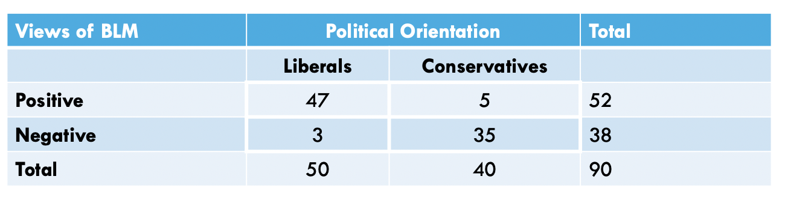
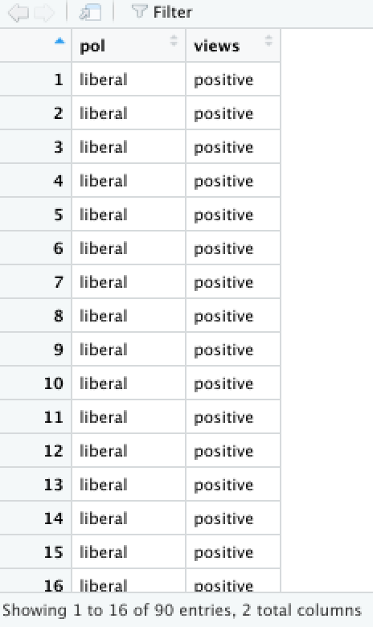

###### Navigation

* [**Intro to R**](Intro-and-Univariate-Statistics.html)
* [**t-Test**](t-test.html) [[*t-Test example*]](t-test-example.html)
* [**Analysis of Variance (ANOVA)**](anova.html) [[*ANOVA example*]](anova-example.html)
* [**Chi Square**](chi-square.html) [[*Chi Square example*]](chi-square-example.html)
* [**Correlation**](correlation.html) [[*Correlation example*]](correlation-example.html)
* [**Regression**](regression.html) [[*Regression example*]](regression-example.html)


### Is there an association between political orientation and views of the Black Lives Matter movement? 


#### The Chi Square Test of Independence

The Chi Square test ($X^2$) examines the association or relationship between two nominal/ordinal variables to see if the relationship reflects a true relationship that we could expect to find in the population. The test also tells us whether or not a category (attribute) of one variable varies by categories of another variable. 

For this example, the Chi Square test works perfectly because we're looking at *categories* of the political orientation variable (liberal and conservative) across *categories* of another (positive and negative views of the Black Lives Matter movement) to see if there is a true association between political orientation and views of BLM in the population. 


```{r, echo=F}
options(repos=c(CRAN="http://cran.stat.ucla.edu/"))
```

# 


```{r, results="hide", warning=FALSE, message=FALSE}
library(MASS)
library(psych)
library(lattice)
library(mosaic)
```

#

#### Reading in the Data

```{r, out.width = "500px", echo=FALSE}

```

In the table (above), we have a total of 90 people, randomly-sampled. We see (by looking at the column marginals) that we have a total of 50 liberal individuals and 40 conservatives in the sample. By looking closer at the cells, we see that, of the 50 liberals, 47 have positive views of BLM while the other 3 have negative views of BLM. Moreover, of the 40 conservatives, 5 have positive views of BLM while the other 35 have negative views of BLM. We can use this breakdown to create a data set, using a combination of the concatenate, <span style="color:blue">`c()`</span>, data frame <span style="color:blue">`data.frame`</span>, and the repeat <span style="color:blue">`rep()`</span> functions. 

The repeat function comes in handy when you have to type out the same values over and over again. This function has two arguments: 1) the thing you want to repeat, and 2) the number of times you want to repeat it. For example, let's say I wanted to create an object called <span style="color:blue">`x`</span>, that repeats the number <span style="color:blue">`7`</span>, 10 times. I would do the following:

```{r}
x <- rep(7,10)
```

and the data would look like this...

```{r}
x
```

Next, let's say I wanted to create an object called <span style="color:blue">`y`</span>, that repeats the string, word, or, in more appropriate terms, group/category <span style="color:blue">`student`</span>, 25 times. I would do the following:

```{r}
y <- rep("student",25)
```

and the data would look like this...

```{r}
y
```

Using this logic, we can apply the repeat function to create each variable, concatenating across the various categories of each variable, and combine these variables into a data frame... as such... 

```{r}
pol <- c(
  rep("liberal",50),
  rep("conservative",40)
  )

views <- c(
  rep("positive",47),
  rep("negative",3),
  rep("positive",5),
  rep("negative",35)
)
```

For brevity, I don't call the variables here, but instead, I'll merge the variables into one data frame, using the following:

```{r}
data <- data.frame(pol,views)
```

and the data should look like this, in your Environment window...

```{r, out.width = "200px", echo=FALSE}

```

#


#### Assumptions and Diagnostics for Chi Square

The assumptions for the Chi Square are...

* Independence of Observations
* Normality


##### 1. Independence of Observations (Examine Data Collection Strategy)
* Cases (observations) are not related or dependent upon each other. Case can’t have more than one attribute. No ties between observations. Examine data collection strategy to see if there are linkages between observations. 
  + <span style="color:red">These data were randomly sampled. `Therefore, we meet the assumption of independence of observations`.</span> 


##### 2. Normality (Examine Crosstabs for Expected Frequencies)


* Distributions must be relatively normal. A good way to see if we meet the normality assumption is to look at the **Expected Frequencies** in each cell of the crosstab. **If 20 percent or more of our Expected Frequencies across all the cells are less than 5 cases ($E \lt 5$), then you violate the assumption of normality**.

*The Chi Square test is finicky, in that you cannot see the expected frequencies (and observed frequencies) until you run the Chi Square function (see below)*


#
### The Chi Square Test Calculation

The calculation for the Chi Square is:

 $X^2 = \sum \frac{(f_o - f_e)^2}{f_e}$ or
 $X^2 = \sum \frac{(f_{o_i} - f_{e_i})^2}{f_{e_i}}$
 
where... <br>

* $f_o$ (or $f_{o_i}$) is the observed frequency for that cell (the $i^{th}$cell)<br>
* $f_e$ (or $f_{e_i}$) is the expected frequency for that cell (the $i^{th}$cell)<br>
  + $f_e$ (or $f_{e_i}$) for each cell is calculated by the following:
    + $f_e$ (or $f_{e_i}$) $= \frac{(r_{total_i})(c_{total_i})}{total}$ $= \frac{(n_{row_i})(n_{column_i})}{N}$


In addition, the degrees of freedom ($df$) for the test is...<br> 
* $df = (r-1)(c-1)$

where...

* $r$ is the number of rows in a crosstabulation<br>
* $c$ is the number of columns in a crosstabulation<br>


### Running the Chi Square Test


For Chi Square, within the <span style="color:blue">`chi.sq`</span> function, the dependent variable is listed first and the independent variable is listed second. 


```{r}
chisq.test(data$views, data$pol, correct=FALSE)
```

In the output above, we see the $X^2$-obtained value (60.506), the degrees of freedom (1), and the p-value (7.334e-15 = 7.334 x $10^{-15}$ = .000000000000007334, which is much less than our set alpha level of .05).


To interpret the findings, we report the following information:

* The test used
* If you **reject** or **fail to reject** the null hypothesis
* The variables used in the analysis
* The degrees of freedom, calculated value of the test ($X^2_{obtained}$), and $p-value$
  + $X^2(df) = X^2_{obtained}$, $p-value$

“Using the Chi Square test of independence ($X^2$), I reject/fail to reject the null hypothesis that there is no association between variable one and variable 2, in the population, $X^2(?) = ?, p ? .05$” 

* <span style="color:red">“Using the Chi Square test of independence ($X^2$), I reject the null hypothesis that there is no association between the political orientation and views of the Black Lives Matter movement, in the population, $X^2(1) = 60.506, p \lt .05$.”</span> 


##### Back to the Normality Assumption

To check if you've met the assumption of normality (e.g. fewer than 20% of cells in the crosstab of expected frequencies falls below $n=5$), you have to make the chi square function (<span style="color:blue">`chi.sq`</span>) into an object... as such... 

```{r}
x2 <- chisq.test(data$views, data$pol, correct=FALSE)
```

and because the actual test is now an object, you can call it's component variables by using the object name, the dollar sign operator (<span style="color:blue">`$`</span>), and the variable named **expected** (you can also call the variable named **observed**) to get a crosstab of each. 

```{r}
x2$observed
```

```{r}
x2$expected
```

* <span style="color:red">We see here that fewer than 20% of cells in the 4x4 table have less than 5 expected counts (actually, no cell has fewer than 5). `Therefore, we meet the assumption of normality`.</span> 


<br><br><br>
