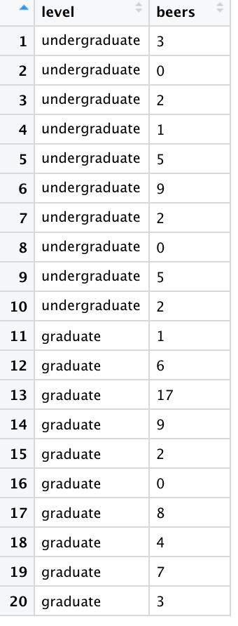

###### Navigation

* [**Intro to R**](Intro-and-Univariate-Statistics.html)
* [**t-Test**](t-test.html) [[*t-Test example*]](t-test example.html)
* [**Analysis of Variance (ANOVA)**](anova.html)


### Is there a mean difference in the number of beers undergraduate students versus graduate students have in their home refrigerator?


#### The t-Test
The t-test is a bivariate (two variable) test that examines the differences in means between **two** groups (no more, no less), in effort to see if the differences reflect true differences that we could expect to find in the population. 

For this example, the t-test works perfectly because we have only two groups (undergraduate students and graduate students), and we're examining each group's mean number of beers in their home fridge to see if there is a true difference between "beers in fridge" amongst the population of undergraduate and graduate students. 


```{r, echo=F}
options(repos=c(CRAN="http://cran.stat.ucla.edu/"))
```

# 


```{r, results="hide", warning=FALSE, message=FALSE, echo=FALSE}
library(MASS)
library(psych)
library(lattice)
library(mosaic)
```

#

#### The Data

In total, we have 10 undergraduate students and 10 graduate students in our sample. The data are as follows:

**Undergrads**: <span style="color:blue">`3, 0, 2, 1, 5, 9, 2, 0, 5, 2`</span> 

**Grads**: <span style="color:blue">`1, 6, 17, 9, 2, 0, 8, 4, 7, 3`</span>.

#

#### Reading in the Data

As in the [Intro to R](Intro-and-Univariate-Statistics.html) vignette, we can create an object out of a list of numbers using the concatenate <span style="color:blue">`c`</span> function.

Knowing that we have two variables: student level (ordinal independent/grouping variable -- undergraduate versus graduate student) and number of beers (interval-ratio dependent variable), we have to read in the variables separately (listing the values for each observation). To do so, we can use the following code:


```{r}
level <- c("undergraduate", "undergraduate", "undergraduate", "undergraduate", "undergraduate", "undergraduate", "undergraduate", "undergraduate", "undergraduate", "undergraduate", "graduate", "graduate", "graduate", "graduate", "graduate", "graduate", "graduate", "graduate", "graduate", "graduate")
beers <- c(3, 0, 2, 1, 5, 9, 2, 0, 5, 2, 1, 6, 17, 9, 2, 0, 8, 4, 7, 3)
```

Where the first observation in level (student type) corresponds with the number in the first observation of beers. For example, the first observation in the list for <span style="color:blue">`level`</span> is an <span style="color:blue">`undergraduate`</span>, which corresponds with the first observation in the <span style="color:blue">`beers`</span> list, of <span style="color:blue">`3`</span>: This means the first observation is an undergraduate who has 3 beers in their fridge at home. 

Next, to appropriately prepare the data for analysis using the t-test, we have to merge the two lists, so that the t-test can compare group membership (level or student type) to number of beers. To merge the data, as in the [Intro to R](Intro-and-Univariate-Statistics.html) vignette, we can use the <span style="color:blue">`data.frame`</span> function. 

```{r}
data <- data.frame(level,beers)
```

Now we can call the data... 

```{r}
data
```

... which should look like this in your Environment window...

```{r, out.width = "200px", echo=FALSE}

```


#### Assumptions and Diagnostics for the t-Test

The assumptions for a t-test are...

* Independence of Observations
* Equal Sample Sizes
* Homogeneity of Variance
* Normality

##### 1. Independence of Observations (Examine Data Collection Strategy)
* Groups are not related or dependent upon each other. Case can’t be in more than one group. No ties between observations. Examine data collection strategy to see if there are linkages between observations. 
  + <span style="color:red">These data were randomly sampled. `Therefore, we meet the assumption of independence of observations`.</span> 

##### 2. Equal Sample Sizes (Examine N for each group)
* The number of cases in each group should be relatively similar. (If not, use pooled variance/unequal variances asssume t-test formula)
  + <span style="color:red">The sample size for each group is not just *nearly* the same, but it is exactly the same for both groups. `Therefore, we have met the assumtption for equal sample sizes`.</span> 

##### 3. Homogeneity of Variance (Examine SD^2^ for each group)
* Both groups have approximately equal variances (SD^2^). The distributions (or spread) for the groups are approximately equal. Keppel & Zedeck (1989) suggest that variance comparison should not exceed 10:1 ratio (*or... alternatively, the SDs, when compared, should not exceed around a 3:1 ratio*). For both of the above assumptions, we can examine the univariate data table, broken out by group:

```{r}
describeBy(data$beers, data$level)
```

  + <span style="color:red">We can see from the output that, comparing the SD for both groups, there is not a ratio larger than 3:1. For these data, the SDs for each group are 4.99 for graduate students and 2.77 for undergraduate students (its only nearly a 2:1 ratio). `Therefore, we have met the assumption for homogeneity of variance`.</span> 

##### 4. Normality (Examine Plots: Histogram, Q-Q Normality Plots, Box-and-Whiskers Plots)
* Distribution must be relatively normal. (If violated, use “unequal variances assumed” formula, otherwise, use “equal variances assumed”)

##### 4a. Histogram

Plot the histogram for *beers* (Y variable) broken out by *student type* (levels of the X variable), overlaying a normal curve... 


```{r}
histogram(~ beers | factor(level), data = data, main = "Histogram of 'Beers' by 'Student Type'", 
          type = "density", 
          panel=function(x, ...) {
            panel.histogram(x, ...)
            panel.abline(v=mean(x, na.rm = TRUE),col="red")
            panel.mathdensity(dmath=dnorm, col="black", 
                              args=list(mean=mean(x, na.rm = TRUE),
                                        sd=sd(x, na.rm = TRUE)), ...)            
          }) 
```

  + <span style="color:red">We can see from the histogram that for both group distributions of the outcome variable (beers), the data are moderately positively skewed (since .89 for undergrads and .91 for grad students is between $|.5|$ and $|1|$. Although this is moderately positively skewed, it is safe to assume that these data are close enough to normal to proceed with the statistical test.</span> 

##### 4b. Boxplots (Box-and-Whisker Plots)

Boxplots also provide a visual representation of the normality of a distribution. The boxplot has a box, a line through the box, two whiskers on either end of the box, and sometimes dots/points outside the whiskers. Below, we get a sense of what each part of the boxplot represents...

+ Bottom (or left end) of the **whisker** represents the minimum score for that variable's distribution
+ Bottom (or left end) of the **box** represents the first quartile (the 25th percentile case)
+ Middle line (or dot) inside the **box** represents the median, also known as the second quartile (the 50th percentile case)
+ Top (or right end) of the **box** represents the third quartile (the 75th percentile case)
+ Top (or right end) of the **whisker** represents the maximum score for that variable's distribution
+ Outside dots represent outliers - extreme high or extreme low values for that variable. 

#
#

To tell if a variable is normally-distrubted using the box-and-whisker plot, generally, we want to see that there is *some* distance between the box and the end of the whiskers, that the box isn't pushed too close to either whisker, that the median line (dot) is near the center of the box, and that there aren't many outliers (dots) on the outside of the whiskers.

#


To plot a boxplot of *Beers*, broken out by *Student Type*, we can do the following...


```{r}
bwplot(~ beers | factor(level), data = data, pch="|", main = "Bar-and-Whisker Plot of 'Beers' by 'Student Type'")
```

  + <span style="color:red">We can see from the boxplot that for both group distributions of the outcome variable (beers), the data are moderately only somewhat normally distributed. For both grads and undergrads, the interquartile range is closer to the lower end of the distribution rather than the middle. Importantly, while the median is in the center of the IQR for graduates, it is off-center and closer to the 25$^{th}$ percentile for undergraduates. Despite these trends, it is safe to assume that these data are close enough to normal, since they aren't *drastically* different from normal, and therefore safe to proceed with the statistical test.</span> <br>
  
#


##### 4c. Normal Q-Q (Quantile-Quantile) Plots

The quantile-quantile plot is a visual tool to help us figure out if the empirical distribution of our variable fits (or rather, comes from) a theoretical normal distribution.

We assess normality an break this plot out by a grouping variable. 

```{r}
xqqmath(~ beers | factor(level), data = data, fitline = TRUE, main = "Normal Q-Q Plot of 'Beers' by 'Student Type'", xlab = "Expected Normal")
```

  + <span style="color:red">We can see from the Q-Q plot that for both group distributions of the outcome variable (beers), the data are somewhat normal, since there is no discernible pattern across the line (e.g. no strong curvilinear trend around normality line) for the *number of beers* variable for either group/level (*student type*) It is therefore safe to proceed with the statistical test.</span> 

  + <span style="color:red">Based on the the three visual depictions above, the data seem normally-distributed. `Therefore, we meet the assumption of normality`.</span> 

### The t-Test

The calculation for the t-Test is:

 $\frac{\bar{x}_1-\bar{x}_2}{\sqrt{\frac{SD_1^2}{n_1}+\frac{SD_2^2}{n_2}}}$
 
where... <br>

* $\bar{x}_1$ is the mean for group 1 <br>
* $\bar{x}_2$ is the mean for group 2 <br>
* $SD_1^2$ is the variance ($SD^2$) for group 1 <br>
* $SD_2^2$ is the variance ($SD^2$) for group 2 <br>
* $n_1$ is the number of observations ($N$) for group 1 <br>
* $n_2$ is the number of observations ($N$) for group 2 <br>

In addition, the degrees of freedom ($df$) for the test is...<br> 
$df = n_1 + n_2 -2$ (aka $df = N-2$)


### Running the t-Test in R


To run the independent samples t-test in R, we use the <span style="color:blue">`t.test`</span> function.

For t-test, within the <span style="color:blue">`t.test`</span> function, the dependent (interval-ratio level) variable is listed first and the independent (discrete/categorical) variable is listed second. 

If you meet the assumptions of the t-test, you can **assume equal variances**, and therefore use the call <span style="color:blue">`var.equal=TRUE`</span>. If you violate the assumptions, use the call <span style="color:blue">`var.equal=FALSE`</span>.


```{r}
t.test(data$beers ~ data$level, var.equal=TRUE)
```

In the output above, we see the t-obtained value (1.5518, or rather, $\pm$ 1.5518), the degrees of freedom (18), and the p-value (0.1381, which is less than our set alpha level of .05).

To interpret the findings, we report the following information:

* The test used
* If you **reject** or **fail to reject** the null hypothesis
* The variables used in the analysis
* The degrees of freedom, calculated value of the test ($t_{obtained}$), and $p$-$value$
  + $t(df) = t_{obtained}$, $p$-$value$

“Using an independent samples t-test, I reject/fail to reject the null hypothesis that there is no mean difference between group 1 and group 2, in the population, $t(?) = ?, p ? .05$” 

“Using an independent samples t-test, I fail to reject the null hypothesis that there is no difference between the mean number of beers for undergraduate students and graduate students, in the population, $t(18) = \pm 1.5518, p > .05$” 


<br><br><br>
